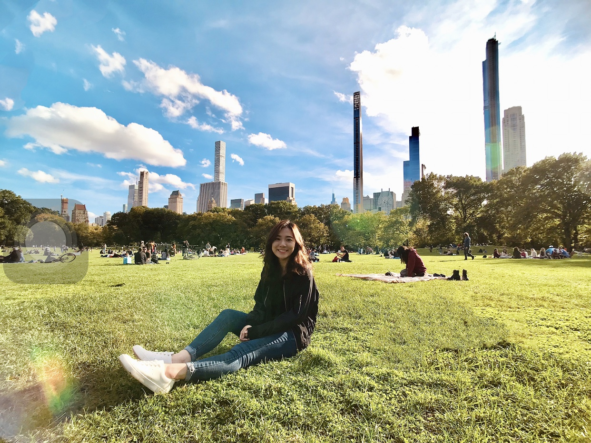
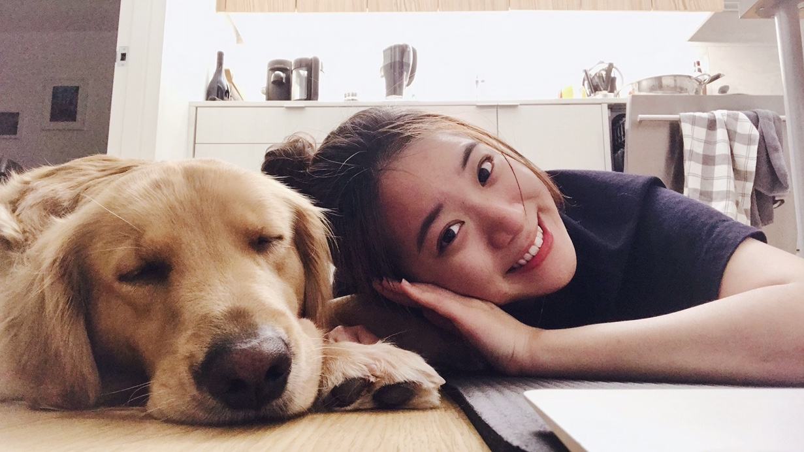
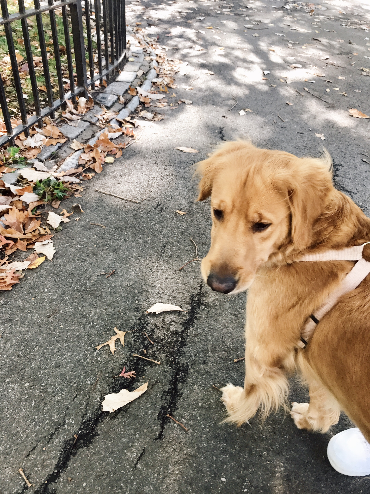

Hi, I am Angeline. So nice to meet you here :)

---

# ABOUT THE WEBSITE

This is the first website that I have created for P8105 - Homework 4.

In this page, you can find:

* [About me](about.html)
* Some graphs created by using plotly
* Data from NYC restaurant inspections 

---

# SOMETHING MORE
Say hi to Juice!
She is a 2 year old golden retriever, a baby of a friend of my friend's.

  
  
  